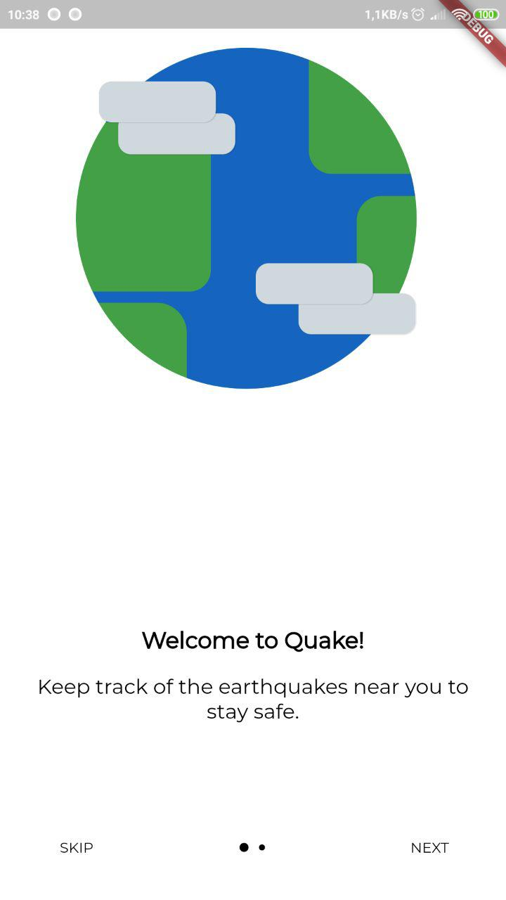
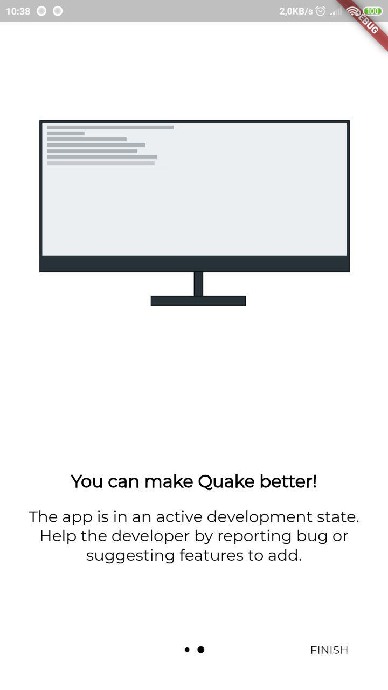

# Quake

> Work In Progress : see [projects](https://github.com/veetaw/quake/projects)
> Telegram Channel : [link](t.me/quake_app)

## what's quake?

Quake is going to be a cross platform (iOS, Android) mobile application that will show you the last earthquakes happened around the world, or near you, with a focus on beautiful design and functionality.

### why?

All earthquake feed applications are poorly designed and some of them drain battery because of asking external server every n seconds for new events to send notifications, 
quake will not do that. A server will send a notification to every user who subscribed to feeds in a particular area.

### Screenshots

Landing page first screen  |  Landing page second screen
:-------------------------:|:-------------------------:
  |  

### Renders

### goals

- [ ] Completely cross platform
- [ ] Stable
- [ ] Functional
- [ ] Simple to use

### development

- [ ] Business logic

    - [x] Earthquake Model
    - [x] API Wrapper
    - [x] DB Helper
    - [x] Check if it's first time opening app on startup
    - [x] Check connection
    - [x] Localization
    - [x] All Earthquakes BLOC
    - [x] Nearby Earthquakes BLOC
    - [ ] Search earthquake
    - [ ] Map Provider for detail page and map page
- [x] Permissions
    - [x] Internet
    - [x] Location
- [ ] UI
    - [x] AppBar
    - [x] BottomAppBar
    - [x] earthquake card model
    - [x] basic listview
    - [x] Page Switching
    - [ ] Detail Page
    - [ ] Map Page
    - [ ] Settings
    - [x] Themes
- [ ] Notifications
    - [ ] Backend
    - [ ] OneSignal
    - [ ] Firebase Auth
- [ ] Android only features
    - [ ] Widget
- [ ] Testing
    - [x] Unit tests
        - [x] Earthquake Model
        - [x] API Wrapper
        - [ ] Database helper
        - [x] Earthquake Bloc
    - [ ] Widget tests
        - [ ] Theme switch
    - [ ] Integration tests
